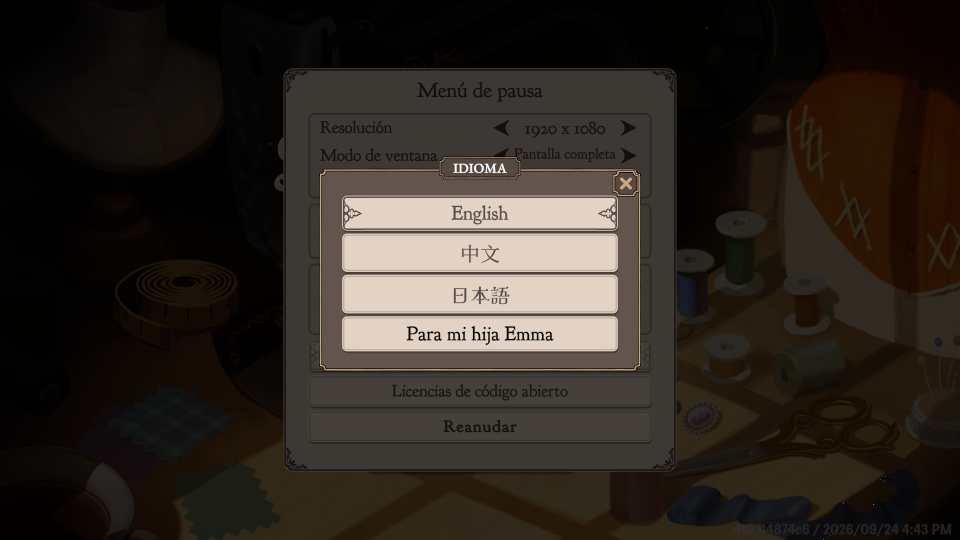

# Dressmaker en Castellano

Traducción al español de **Dressmaker** (Cozy Lives / Free Lives, Steam 4019220).
*Spanish translation for Dressmaker — English summary at the end.*

Añade el español como **un idioma más** en *Opciones > Idioma*, junto a English, 中文 y 日本語.
Se cambia de uno a otro al momento, sin tocar los archivos del juego y sin pisar el inglés.

El botón se llama **«Para mi hija Emma»**, porque este mod se hizo para ella. Si lo quieres de
otra manera, se cambia en `BepInEx\config\masterwin.dressmaker.es.cfg` (`NombreEnMenu`).

## Descargar

**[Última versión](../../releases/latest)** · también en [Nexus Mods](https://www.nexusmods.com/dressmaker/mods/185).

## Instalar

1. Instala [BepInEx 5 x64](https://github.com/BepInEx/BepInEx/releases) en la carpeta donde está
   `Dressmaker.exe` (no un nivel por encima) y abre el juego una vez.
2. Descomprime el zip en esa misma carpeta (se crea `BepInEx\plugins\DressmakerES`).
3. En el juego: *Opciones > Idioma > Para mi hija Emma*.

Si tienes **Dress Maker ESP** instalado, quítalo (borra `BepInEx\plugins\DressMakerSpanish`): escribe
el español encima del inglés y los dos a la vez se pisan.

## Qué traduce

| Tabla | Traducido |
|---|---|
| Telas, accesorios, patrones, piezas, encargos, colores… | 1 909 de 1 930 |
| Diálogos | 3 578 de 3 677 (lo que falta son «…», «Oh.», «Hmm.») |
| Interfaz | 208 de 208 |
| Tutorial | 71 de 71 |

También los dos avisos que el juego tiene fijos en inglés: «Desbloqueado: …» y «¡No tienes telas!».
Se quedan en inglés los nombres de las clientas y las 5 imágenes con texto (cartel de la tienda,
folleto de prestigio, periódico y título).

## Versión del juego

Probado en la build **410.44874e6** (24/09/2026) con BepInEx 5.4.23.5 x64. Si un parche añade
textos nuevos, salen en inglés hasta que se traduzcan: nunca en blanco.

¿Ves un texto cortado, montado o mal traducido? Abre un [issue](../../issues) con una captura.

## Créditos y licencia

- Plugin y textos de objetos rehechos desde las tablas del juego: **Masterwin**.
- Base de los diálogos, la interfaz y el tutorial: [Dress Maker ESP](https://www.nexusmods.com/dressmaker/mods/32)
  de **Gabssby**, revisada y corregida, con su permiso. ¡Gracias, Gabssby!

Plugin: [MIT](LICENSE). Nuestras traducciones: CC BY 4.0 (detalle en el zip, `LICENSE-traduccion.md`).
Dressmaker es de Cozy Lives; este mod no es oficial.

---

### English

Adds **Spanish** as one more language in *Options > Language* (the button reads «Para mi hija
Emma», "For my daughter Emma"; rename it in `BepInEx\config\masterwin.dressmaker.es.cfg`).
Install [BepInEx 5 x64](https://github.com/BepInEx/BepInEx/releases) next to `Dressmaker.exe`,
run the game once, then unzip the [latest release](../../releases/latest) into the same folder.
Tested on build 410.44874e6. MIT (plugin) · CC BY 4.0 (our translations).
